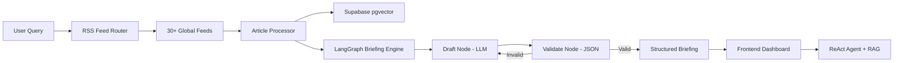

# 📊 F.A.I.T — Finance, AI & Tech Intelligence

     

> **Watch the Fate of Markets, AI & Tech** — An AI-powered intelligence briefing engine that synthesizes real-time news from 30+ global sources into structured analytical reports.
> 
> 🔴 **Live Demo:** [https://news-navigator-hro3.onrender.com/](https://news-navigator-hro3.onrender.com/)
## ✨ Why This Project

This project demonstrates production-grade AI engineering patterns that are immediately relevant to roles in **Quant, FinTech, and Data Science**:

- **RAG Pipeline**: Vector similarity search over live news using Supabase `pgvector` + lightweight ONNX embeddings
- **Agent Orchestration**: LangGraph state machines with retry logic, validation nodes, and conditional edges
- **Token Optimization**: Dual-model architecture (70b for synthesis, 8b for classification) with real-time usage tracking
- **Cost-Conscious Design**: Every LLM call is optimized — truncated inputs, capped articles, compressed prompts — to minimize daily token consumption

## 🚀 Features

### Automated Intelligence Briefings
Type any finance, tech, or AI topic and get a structured, analytical briefing synthesized from multiple global RSS sources (Reuters, TechCrunch, CoinDesk, CNBC, MIT Tech Review, and more).

### Interactive Follow-up Assistant
Chat with your briefing using a LangGraph ReAct agent backed by RAG. It queries the embedded knowledge base to answer highly specific follow-up questions about the articles.

### F.A.I.T Sentinel (Event Monitoring)
Define custom trigger conditions (e.g., *"Fed cuts rates below 4.5%"*). The Sentinel evaluates live headlines against your conditions using the fast 8b model and alerts you when matching events occur.

### Token Usage Analytics
Built-in `/api/stats` endpoint tracks approximate token consumption per endpoint, daily totals, and all-time usage — demonstrating cost-awareness in LLM application design.

### Dark / Light Mode
Premium UI with a full dual-theme system (emerald/navy dark + clean slate light), glassmorphism panels, and smooth transitions.

## 🛠 Architecture



## 🏗 Tech Stack

| Layer | Technology | Purpose |
|---|---|---|
| **Backend** | FastAPI | Async API server with middleware |
| **AI Orchestration** | LangGraph + LangChain | State machine for briefing synthesis, ReAct agent for Q&A |
| **LLM (Primary)** | Llama-3.3-70b-versatile (Groq) | High-quality synthesis and analysis |
| **LLM (Fast)** | Llama-3.1-8b-instant (Groq) | Token-efficient classification and quick briefings |
| **Vector DB** | PostgreSQL + pgvector (Supabase) | Cosine similarity search over article embeddings |
| **Embeddings** | `fastembed` (all-MiniLM-L6-v2) | Ultra-low memory ONNX embeddings (<100MB RAM) |
| **Frontend** | Vanilla HTML/CSS/JS | Premium glassmorphism UI with dark/light themes |

## 📡 API Endpoints

| Method | Endpoint | Description |
|---|---|---|
| `POST` | `/api/navigator` | Generate a structured briefing for a topic |
| `POST` | `/api/ask` | Ask follow-up questions using RAG |
| `POST` | `/api/alerts/create` | Create a new Sentinel alert |
| `GET` | `/api/alerts` | List all active alerts |
| `DELETE` | `/api/alerts/{id}` | Delete an alert |
| `POST` | `/api/sentinel/run` | Trigger the Sentinel evaluation manually |
| `GET` | `/api/health` | System health with uptime, model info, feed count |
| `GET` | `/api/stats` | Token usage analytics (daily + all-time) |
| `GET` | `/api/keepalive` | Keep free hosting tiers awake |

## 🚀 Running Locally

### Prerequisites
1. Python 3.10+
2. A free [Groq](https://console.groq.com/) API Key
3. A free [Supabase](https://supabase.com/) Project

### 1. Supabase Setup
Enable the vector extension and create the required tables by running this SQL snippet in your Supabase SQL Editor:
```sql
CREATE EXTENSION IF NOT EXISTS vector;

CREATE TABLE article_embeddings (
    id BIGSERIAL PRIMARY KEY,
    topic TEXT NOT NULL,
    content TEXT NOT NULL,
    source_title TEXT,
    source_link TEXT,
    pub_date TEXT,
    embedding vector(384)
);

CREATE TABLE user_alerts (
    id UUID PRIMARY KEY DEFAULT gen_random_uuid(),
    keyword TEXT NOT NULL,
    trigger_condition TEXT NOT NULL,
    is_active BOOLEAN DEFAULT TRUE,
    created_at TIMESTAMP WITH TIME ZONE DEFAULT timezone('utc'::text, now())
);

-- Cosine similarity match function
CREATE OR REPLACE FUNCTION match_documents (
  query_embedding vector(384),
  match_threshold float,
  match_count int,
  match_topic text
)
RETURNS TABLE (
  id bigint,
  content text,
  source_title text,
  source_link text,
  pub_date text,
  similarity float
)
LANGUAGE sql STABLE
AS $$
  SELECT
    article_embeddings.id,
    article_embeddings.content,
    article_embeddings.source_title,
    article_embeddings.source_link,
    article_embeddings.pub_date,
    1 - (article_embeddings.embedding <=> query_embedding) AS similarity
  FROM article_embeddings
  WHERE article_embeddings.topic = match_topic
    AND 1 - (article_embeddings.embedding <=> query_embedding) > match_threshold
  ORDER BY article_embeddings.embedding <=> query_embedding
  LIMIT match_count;
$$;
```

### 2. Environment Variables
Create a `.env` file in the root directory:
```env
GROQ_API_KEY="your-groq-key"
SUPABASE_URL="your-supabase-url"
SUPABASE_KEY="your-supabase-service-key"
```

### 3. Install & Run
```bash
# Create a virtual environment
python -m venv venv
source venv/bin/activate  # On Windows: venv\Scripts\activate

# Install dependencies
pip install -r requirements.txt

# Start the server
uvicorn app.main:app --reload
```
Navigate to `http://localhost:8000` to start using the app.

## 📡 Triggering the Sentinel
The Sentinel evaluates all active alerts against live headlines. Trigger it via:
```bash
POST /api/sentinel/run
```
*Tip: Use [cron-job.org](https://cron-job.org/) to hit this endpoint once a day automatically.*

## 💰 Token Optimization Strategy

F.A.I.T is designed for daily personal use with minimal token consumption:

| Optimization | Impact |
|---|---|
| Article description truncation (200 chars) | ~40% fewer input tokens per briefing |
| Article cap reduced (15 → 12) | ~20% fewer input tokens |
| Dual-model architecture (8b for quick/eval) | ~60% cheaper for quick briefings and alerts |
| Conversation history limit (6 messages) | Prevents context window bloat on long sessions |
| Compressed system prompts | ~35% smaller prompts across all endpoints |

Monitor your usage in real-time at `/api/stats`.
